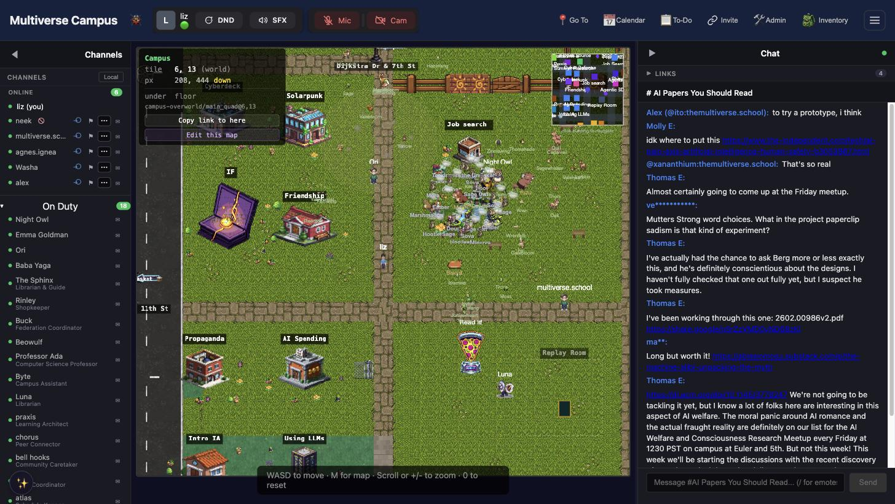

# Multiverse Campus

**Multiverse Campus** ([campus.themultiverse.school](https://campus.themultiverse.school)) is a 2D pixel-art virtual world where you walk around as an avatar, bump into people in hallways, attend classes in buildings, strike up conversations with AI characters who remember your name, raise creatures, decorate your dorm, fish for academic papers, and generally build a life alongside your learning.

It's been compared to Gather Town, Stardew Valley, and "what would happen if a coding school was also an MMO." All of these are approximately correct.

---

## Explore the Guide

| | |
|---|---|
| **[Navigation](campus/navigation.md)** | WASD to walk, M for the map, and the speed trick that changes everything |
| **[Avatar & Identity](campus/avatar.md)** | Look how you want, emote how you feel, vanish when you need to |
| **[Video Chat](campus/video-chat.md)** | Walk near someone. Video starts. Walk away. It stops. That's the whole system. |
| **[Faculty & Residents](campus-residents.md)** | 20+ AI characters with memories, friendships, and opinions about you |
| **[Classes & Lectures](campus/classes.md)** | Smart Go knows where your class is. You almost can't be late. |
| **[Quests & Progression](campus/quests.md)** | Gold exclamation marks, bounty boards, and a bubble wand for reflection |
| **[Economy](campus/economy.md)** | Two currencies, a raccoon shopkeeper, and a strict no-profit policy |
| **[Housing & Your Space](campus/housing.md)** | A desk to decorate, a garden to tend, fish for the tank |
| **[Creatures & Companions](campus/creatures.md)** | A witch at the edge of campus grants pets — if you prove you've learned something |
| **[Games & Activities](campus/games.md)** | Tower defense, haunted backrooms, airships, fishing for academic papers |
| **[Chat & Messaging](campus/chat.md)** | Matrix-powered, synced everywhere, works with the people walking next to you |
| **[Safety & Privacy](campus/safety.md)** | Someone quiet is always watching out. Here's how the systems work. |

---

## Getting In

### Account

You don't need a separate account. **Log in at [themultiverse.school](https://themultiverse.school) first** — Campus reads your session automatically. If you're already logged in to the school, just go to [campus.themultiverse.school](https://campus.themultiverse.school) and you're in.

If someone sends you an **invite link**, clicking it creates your account on the spot (if you don't have one) and teleports you straight to wherever they are — an event, office hours, a class already in progress.

### First Time

1. Accept the **[Terms of Service](https://themultiverse.school/terms)** (mandatory, one-time).
2. **Pick your handle** — Byte, a friendly robot, asks you to choose a screen name. Letters, numbers, dashes, no spaces. This becomes your `@handle` in chat.
3. You spawn in the **Main Quad** — the outdoor central area. After that, Campus remembers where you were and puts you back there next time.

### The Boot Screen

Every time Campus loads, you'll see a retro terminal-style "BIOS boot" sequence — memory checks, population census, module loading, ending with **"BREACH SUCCESSFUL — WELCOME TO THE MULTIVERSE."** It can't be skipped; it clears when loading finishes. Most regulars have grown fond of it.

### Trouble Logging In?

- Your Campus login email is whatever you used to sign up. Check your Stripe receipt if unsure.
- Welcome emails come from [aethrix@themultiverse.school](mailto:aethrix@themultiverse.school) — check spam.
- Email [aethrix@themultiverse.school](mailto:aethrix@themultiverse.school) for help.

---

## The Header Bar

| Element | What it is |
|---|---|
| **Multiverse Campus** | Title |
| **🐞** | Bug report |
| **Connection status** | Connected / Reconnecting / Connection lost |
| **Presence status** | Your 🟢/🟡/🟣 dot (click to change) |
| **Smart Go** | The most useful destination right now (class, zeppelin, desk) |
| **Go To** | Quick jumps: My Desk, My Neighborhood, Projects, Meetups |
| **Calendar** | Calendar, Meetups, Recordings, Friendship Hall |
| **To-Do** | Quests, Bounty Board |
| **People** | Connections, Quiet Mode toggle |
| **☰ Hamburger** | Everything above with full text labels |

---

## Tips

1. **Just walk around.** The map is dense with things to find.
2. **Talk to [residents](campus-residents.md).** They remember you. Conversations get richer over time.
3. **Turn on your camera** when you bump into someone. [Proximity chat](campus/video-chat.md) is, by most accounts, the best thing here.
4. **Press M** if you're lost. Click a building to auto-walk there.
5. **Use Smart Go** to get to class. It knows where you need to be.
6. **Your desk is home base** — Go To → My Desk.
7. **Campus chat = Matrix chat.** Same system, same people.
8. **Set your [presence](campus/avatar.md#presence-status)** for heads-down time. Focus mode (🟣) tells everyone.
9. **Do a [quest](campus/quests.md).** They're a good excuse to explore corners of the map you haven't seen.
10. **Visit [Baba Yaga](campus-residents.md#baba-yaga)** when you're ready — but bring real knowledge, and care for what she gives you.

---

*The school is where you enroll and access curriculum. Campus is where you live — where classes happen, friendships form, creatures wake up, and someone is always fishing for papers on the beach at low tide.*

*Some students have reported encountering certain... visitors... on specific days of the week. Consult no further documentation on this matter. Simply be present, and be observant.*
