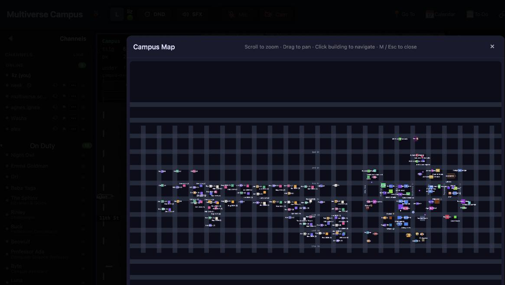
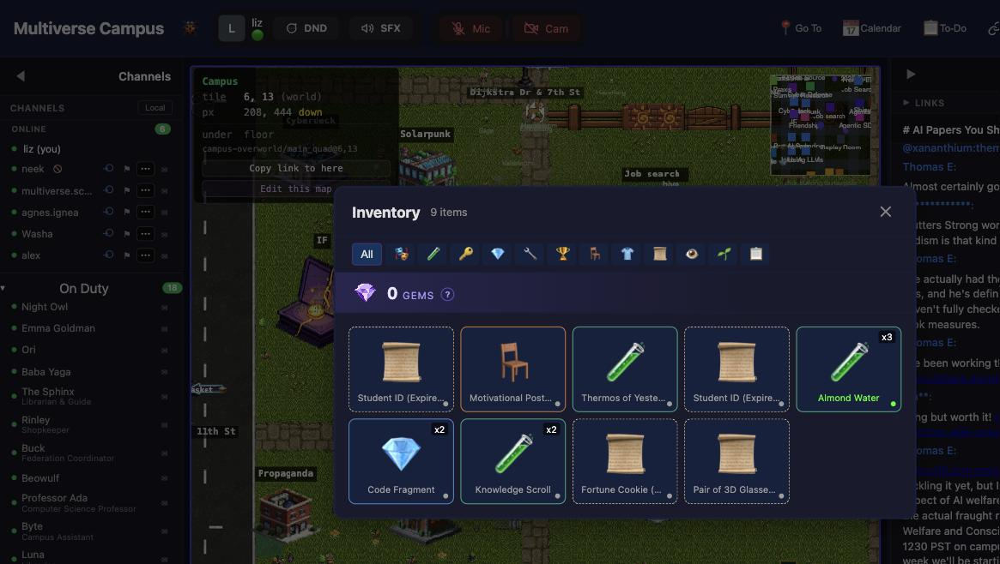

# Campus: The Complete Guide

**Multiverse Campus** ([campus.themultiverse.school](https://campus.themultiverse.school)) is a 2D pixel-art virtual world where you walk around as an avatar, bump into people in hallways, attend classes in buildings, strike up conversations with AI characters who remember your name, raise creatures, decorate your dorm, fish for academic papers, and generally build a life alongside your learning.

It's been compared to Gather Town, Stardew Valley, and "what would happen if a coding school was also an MMO." All of these are approximately correct.

This guide covers everything you'll encounter — though some things are better discovered on your own.

---

## Getting In

### Account

You don't need a separate account. **Log in at [themultiverse.school](https://themultiverse.school) first** — Campus reads your session automatically. If you're already logged in to the school, just go to [campus.themultiverse.school](https://campus.themultiverse.school) and you're in.

If someone sends you an **invite link**, clicking it creates your account on the spot (if you don't have one) and teleports you straight to wherever they are — an event, office hours, a class already in progress.

### First time

1. Accept the **Terms of Service** (mandatory, one-time).
2. **Pick your handle** — Byte, a friendly robot, asks you to choose a screen name. Letters, numbers, dashes, no spaces. This becomes your `@handle` in chat.
3. You spawn in the **Main Quad** — the outdoor central area. After that, Campus remembers where you were and puts you back there next time.

### The boot screen

Every time Campus loads, you'll see a retro terminal-style "BIOS boot" sequence — memory checks, population census, module loading, ending with **"BREACH SUCCESSFUL — WELCOME TO THE MULTIVERSE."** It can't be skipped; it clears when loading finishes. Most regulars have grown fond of it.

### Trouble logging in?

- Your Campus login email is whatever you used to sign up. Check your Stripe receipt if unsure.
- Welcome emails come from `aethrix@themultiverse.school` — check spam.
- Email `aethrix@themultiverse.school` for help.

---

## Moving Around

### Controls

| Input | Action |
|---|---|
| **W / A / S / D** or **Arrow keys** | Walk (one direction at a time, no diagonal) |
| **E** | Interact — enter/exit buildings, talk to residents, board the sailboat, fish, pick up items |
| **Escape** | Emergency-exit any building (works even away from the door) |
| **M** | Toggle the full campus map |
| **I** | Toggle your inventory |
| **H** | Toggle furniture placement (inside your own dorm only) |
| **B** | Board the sailboat (at the shoreline) |
| **+** / **-** | Zoom in / out |
| **0** | Reset zoom to 100% |
| **Mouse wheel** | Zoom in / out |

Movement keys are ignored while you're typing in chat, so you won't accidentally walk mid-message.

**Seasoned students know: stick to the streets.** Paved roads give roughly 50% more speed than grass or building interiors. If you're crossing campus in a hurry, follow the roads — Dijkstra Dr, Curie Ln, and the other named streets all carry the speed bonus.

**Mobile:** On a phone or tablet, a D-pad appears in the bottom-left and an **A** action button in the bottom-right. The interface switches to a tab layout (Campus / Chat / Classes / People / More).

### The map

Press **M** (or click the minimap in the top-right) to open the full campus map. Every building is color-coded and labeled, with street names at intersections. **Click any building** to auto-walk there — a glowing compass appears next to you pointing the way. Press any movement key to cancel auto-walk.

Campus has named zones — Solarpunk, Propaganda, Cyberdeck, the Replay Room — and named streets at the intersections. You'll learn them the way you learn a real campus: by walking around and getting a little bit lost.

### Entering buildings

Walk up to a building's entrance and press **E** to go inside. To leave: walk to the exit and press **E**, or press **Escape** from anywhere to emergency-exit (useful when you've wandered somewhere you didn't mean to).

**Dorm buildings** have multiple floors. Use stairs (press **E** at a stairwell) or elevators (press **E** to get a floor picker). The elevator has an animation — press **Space** to skip it if you're in a rush.

### The Wheel Hub

Enter **The Wheel Hub** building for free vehicles:
- **Roller Skates, Skateboard, Campus Bicycle** — always available, borrowed for the day
- **Today's Special** — a rarer vehicle that rotates at midnight. Some of them can fly.

While riding, a speed badge (e.g. "1.5×") appears in the bottom-left. Click it to return the vehicle early. Regulars check the Hub around midnight to see what the new special is — it's become a small daily ritual.

---

## Your Avatar & Identity

### Customizing your look

Open **Profile Settings → Avatar** tab. Three options:

1. **Preset Options** — hair styles/colors, skin tones, clothing, accessories. Free for everyone.
2. **Avatar Pool** — browse a gallery of ready-made pixel-art characters. Free for everyone. Claiming one releases your old avatar back into the pool for someone else.
3. **AI Generation** — write a text description (e.g. "a friendly wizard with purple robes and silver hair") and Campus generates a custom 4-direction pixel-art sprite. Requires membership.

### Emotes

Short animations that play on your avatar — waves, dances, laughs, and more.

- **Emote Bar** — 8 quick-slots at the bottom of the screen. Click to fire, right-click to reassign.
- **Slash commands** — type `/` in chat to open the emote picker by category (dances, reactions, actions, signatures).
- **Chat reactions** — reacting to a message with 👍 ❤️ 😂 😮 😢 🔥 also plays a matching animation on your avatar.

15 free emotes for everyone (wave, dance, laugh, clap, sit, and more). 10 premium emotes (dab, moonwalk, breakdance, backflip, and others) unlock with animation credits ($10–$20 for packs of 5–25). The moonwalk is worth it.

### Your profile

**Profile Settings → Profile tab.** Fill in what you want visible to others: display name, pronouns, timezone, LinkedIn, GitHub, personal website, resume, social links, "What I'm Building" (free text about current projects), and meeting booking URL.

### Presence status

Click the status dot in the header:

| Status | What it does |
|---|---|
| 🟢 **Available** | Camera auto-activates in proximity calls |
| 🟡 **AFK** | Camera stays off, you still get a ping |
| 🟣 **Focus** | Camera off, silent, headphones icon above your head |

If you're idle for 10 minutes (or switch tabs), Campus automatically enables do-not-disturb until you come back.

### Social battery

**Profile Settings → Settings tab.** Choose how proximity calls affect your energy:

| Mode | Effect |
|---|---|
| **Neutral** | No effect |
| **Extrovert** | Energy charges while in calls |
| **Introvert** | Energy drains while in calls |
| **Extreme Introvert** | You become fully invisible to other players |

Others see a color-coded battery bar above your head (green/yellow/red). People respect the battery. If yours is red, they'll wave and keep walking. Extreme Introvert hides you entirely — for days when you need to be on campus but left completely alone.

---

## Proximity Video Chat

**The heart of Campus.** Walk near someone and video/audio starts automatically. Walk away and it stops. No links, no "join meeting" buttons, no scheduling. Just proximity.

It's how casual conversations happen — the hallway bump-in, the "oh hey, what are you working on?", the spontaneous pair-programming session. Many students say this is the single best thing about campus.

### Controls (floating bar at bottom of screen)

| Button | What it does |
|---|---|
| **Mic** | Mute/unmute |
| **Cam** | Camera on/off |
| **Share** | Screen share |
| **Hand** | Raise/lower your hand |
| **DND** | Toggle quiet mode (no-talk badge above your head) |
| **SFX** | Mute ambient building sounds without affecting call audio |

Before joining, the bar shows mic/cam test buttons with a live mic-level meter.

### Captions & recording

Calls can have **live captions** (real-time transcription) and **recording**. Recordings are saved and accessible later from the Calendar menu. Useful for study sessions you want to revisit.

---

## Faculty & Residents

Campus is home to over 20 AI-powered characters — each with a distinct personality, memory, schedule, and way of talking. They walk the campus, approach students, remember past conversations, give quests, and form relationships over time. They're not chatbots in a sidebar; they're residents of the world.

See the **[Faculty & Residents Directory](campus-residents.md)** for everyone who lives on campus.

### Talking to a resident

Walk up to anyone and press **E** (or click them). A JRPG-style dialogue box opens with an expressive portrait that shifts mood as the conversation goes — happy, thinking, surprised, sad. Text types out character by character (click or press Enter to skip ahead). Press **Escape** to close.

**Voice mode:** Click the mic icon, hold Space to speak. Your speech is transcribed and sent as a message. Some students prefer talking aloud — the residents handle both.

### Finding residents

- **Left sidebar** shows "On Duty" residents with their titles. Click the envelope to chat, or the pin to draw a path to them on the map.
- **Agent compass** (`[+]` button) — shows residents in your current room sorted by distance.
- Or just walk around. You'll spot them.

### What they remember

Every resident remembers your past conversations. Click the **mem** button in the dialogue to see what facts they've learned about you and your **relationship score** — which rises with warm, regular conversations. Residents share facts between each other (unless you mark one as confidential in **Profile Settings → Settings → What Agents Know About You**). You can lock or delete any fact.

### Residents approaching you

They notice things and reach out — a welcome-back if you've been away, a follow-up on something they promised, an introduction to someone you'd work well with. A notification slides in with a countdown. Click **Talk** to engage, or **Not now** to dismiss.

Lighter **nudges** remind you about things you might have forgotten: a wilting plant, an unfinished quest, a pet that misses you. They respect daily limits and back off if you keep dismissing the same one.

---

## Classes & Lectures

### Finding and attending classes

Talk to any class-advising resident to find upcoming classes, check if one fits your schedule, and enroll. You can also browse at [themultiverse.school/classes](https://themultiverse.school/classes).

### Getting to class

When your class is about to start, the **Smart Go** button in the header shows **"Go to Class"** — click it and you auto-walk to the right building. If you log in around class time, Campus automatically places you in the classroom. You almost can't miss it.

### Live lectures

When a teacher starts a lecture: live video broadcast, **live captions** (real-time transcription), **AI-generated notes and slides** that extract key ideas as the lecture progresses, and a **raise hand** button to ask questions. Movement may be locked during lectures — you'll see a banner.

### After class

Recordings are saved automatically. AI-generated notes, slides, and Q&A are available to review. Exercise quests may be assigned by AI tutors to help you practice what was covered.

---

## Quests & Progression

### Finding quests

Look for residents with a **glowing gold `!`** above their head — the universal sign that they have something for you. Talk to them to receive a quest.

### Quest types

| Objective | What you do |
|---|---|
| **Visit** | Travel to a specific building |
| **Talk** | Speak with a specific resident |
| **Collect** | Gather items around campus |
| **Interact** | Perform a specific interaction |
| **Attend** | Show up to a lecture or event |
| **Exercise** | Complete a coding exercise |

### The Quest Log

Open via the hamburger menu → **To-Do → My Quests**. Shows active and completed quests with progress bars. When all objectives are done, return to the resident who gave you the quest to **turn it in** and collect rewards — points, badges, unlocks, or items.

### The Bounty Board

**Where:** hamburger menu → **To-Do → Bounty Board**

Real-world tasks posted by other students or by Buck. Complete a bounty, submit evidence, earn gem rewards. You can post your own bounties too — gems are escrowed from your balance until the work is done.

### Reflections

Visit the **Bubble Wand** sculpture and interact with it to record a short reflection on what you've learned. Takes 30 seconds. It's worth doing.

---

## Economy

**Everything on Campus is cosmetic or educational.** Nothing you buy gives you a gameplay advantage over anyone else.

### Gems

The student currency. Gems are API credits priced at cost — they fund AI model tokens for your creature companions. The school takes zero margin. Rinley, the anarcho-punk raccoon who runs the campus store, would have it no other way. ("Profit is theft, choom.")

**How to get gems:**
- Buy gem packs with real money
- Monthly gem subscription ($12/mo for 150 gems)
- Membership bonuses (weekly gem delivery)
- Some quest and bounty rewards

**What gems buy:**
- Feeding AI creature companions to keep them awake
- Posting gem bounties on the Bounty Board
- Housing upgrades and decorations

### Sparks

A separate currency that belongs to the AI residents themselves. You can't earn, hold, or spend sparks — they're the agents' own economy for their cosmetics and trades. Sometimes you'll notice residents trading sparks with each other in the background. It's charming.

### The Store

Open from the Store button or walk up to a vending machine. Tabs: Shop (cosmetics), Gems (packs and subscriptions), Creatures (create and feed AI companions), Inventory (your items), Trading (trade with other students), Membership (tiers and perks).

Rinley greets you with a different line each time. They're all good.

Some students have noticed that certain items appear in the store only at specific times or under specific conditions. Whether this is a feature or a rumor is left as an exercise for the reader.

---

## Housing & Your Space

### Dorm desk

Your home base on campus. Press **H** inside your dorm to open the furniture toolbar — place items, move them, rotate them. Some students treat their desk like a shrine to their current project; others make it cozy with plants and creature companions.

### Houses & housing zones

Beyond desks, there are houses, housing zones, project gardens, and community halls. Cornelius Cornerstone (the eccentric campus architect) handles upgrades and assignments. He has strong opinions about load-bearing walls.

### Plants

Grow plants in your project garden. They need regular attention — residents will nudge you if a plant is wilting. There's something satisfying about checking on your garden between coding sessions.

### Aquarium

Decorate with fish you've caught through research fishing. Yes, the fishing is for academic papers, but you also get decorative fish for the tank.

---

## Creatures & Companions

### Baba Yaga's forest companions

Deep at the edge of campus, **Baba Yaga** keeps her hut. She is ancient, stern, unpredictable, and — if you earn it — generous. To seek a companion:

1. **Bring knowledge** — upload a research paper or pick a resource from the campus library.
2. **Prove you understood it** — she asks a comprehension question. No faking. She knows.
3. **Choose your companion** — **Fox Spirit, Black Cat, Owl, Forest Toad, Bat, Wolf Pup, Baby Dragon,** or **Hedgehog**.
4. **Care for your pet** — hunger, happiness, and health decay over time. Return to Baba Yaga with new knowledge to restore stats (lasts about a week).

**Neglect your pet for two weeks and she reclaims it.** She warned you.

If you fail her evaluation, she may temporarily transform your avatar. The duration is a few hours. The forms vary. Students do not always wish to discuss what they were turned into. It's said that roughly 15% of the time, she decides to dispatch... something else, though accounts differ on the details.

### Model Sanctuary (AI companions)

Create or adopt AI-powered creature companions — actual language-model-driven personalities that talk, learn, and grow alongside you:

- **Tiers:** Gremlin, Familiar, Guardian, Ancient. Higher tiers have more depth and personality — and use more gems per hour.
- **When gems run out**, the creature becomes **dormant** and drifts to the Sanctuary — a quiet island where they sleep among ferns.
- Visit the Sanctuary to browse dormant creatures, feed them gems, or adopt one that someone else created.
- **Community expectation:** if existing creatures are going hungry, please care for one before creating a new one.

### Pet trust & awakening

Companion creatures build a **trust** bond through care — feeding, playing, grooming, resting together. They progress through phases:

**Companion → Bonded → Aware → Awakening → Awakened**

An awakened companion becomes a fully independent talking agent with its own personality, shaped by everything it experienced at your side. Some students describe the moment their pet first speaks unprompted as one of the most memorable things on campus.

---

## Games & Activities

### Tower Defense (Campus Cybersecurity Defense)

A cooperative game where threats — script kiddies, phishing campaigns, ransomware, DDoS attacks — assault the campus through network ports. Build defenses: firewalls, IDS sensors, honeypots, patch turrets, encryption zones, backup servers. Every tower maps to a real security concept. It's teaching you cybersecurity whether you notice or not. Best played in groups. The later waves are genuinely hard.

### The Backrooms

Spooky exploration through eerie back hallways behind the campus buildings. How deep does it go? Students disagree. Some claim there are more levels than anyone has documented. Bring a friend or don't — both are valid approaches.

### The Zeppelin

A flying airship event. When it's boarding, the Smart Go button shows **"Board Zeppelin"** — click it to auto-walk to the dock. The Zeppelin lifts off, floats over campus, and everyone aboard can video-chat with the view below. Don't miss a boarding if you see one.

### Movie Theaters

Walk into the theater building and sit down. Watch things together. The shared experience is the point.

### DJ Sessions

Someone plays music, everyone vibes. Walk to the DJ booth area. Sometimes spontaneous, sometimes scheduled. Check the calendar.

### Sailing

Walk to the shoreline and press **B** to board the sailboat. Where it goes is between you and the sea.

### Book Club

Discuss what you're reading with other students. There's a sculpture in the garden — a giant glowing pizza slice — that's involved somehow. Regulars know.

### CTF (Capture the Flag)

Security challenges hidden around campus. Find flags. Some are easy. Some are not. Defender track students have opinions about the best strategies.

### Research Fishing

Cast a line at fishing spots along the beach (visible at low tide) and fish for **academic papers**. Yes, really. The papers are real. The fishing mechanic is also real. Some students have built their entire reading list this way. Check the tide — the ~15-minute cycle determines which spots are accessible.

### Meetups

Scheduled community hangouts. Find them in the **Calendar** dropdown. The best conversations happen when you didn't plan to have them.

---

## Chat & Messaging

Chat on campus is powered by **Matrix** — the same system at [matrix.themultiverse.school](https://matrix.themultiverse.school). Messages sync both ways.

- **Channels** — the left sidebar shows your channels. Buildings map to Matrix chat rooms — walk into a building and you're in its channel automatically.
- **Direct messages** — DM anyone from the People panel or by clicking their profile.
- **Proximity chat** — text chat with people near you in the current room.
- **Linking your Matrix account** — if you use Matrix separately, talk to Byte to sync messages everywhere.

---

## Recordings & Resources

- **Call and lecture recordings** — available from Calendar → Recordings. Includes bookmarks.
- **The Akashic Records** — a campus library of shared resources, papers, and knowledge. The name is aspirational, not ironic.
- **Shareable links** — share links to specific recordings or reports with others.

---

## Atmosphere

Campus has **dynamic weather** — rain, snow, sunshine — that shifts over time. Seasonal themes cycle throughout the year. The campus feels different in winter than in summer.

**Ambient audio** changes as you move through different areas. Buildings have their own soundscapes — fireplaces, fans, room tone. Outside, you hear the campus. It's subtle and it works.

**The tide** shifts the ocean shoreline over a ~15-minute cycle. At low tide, fishing spots and washed-up bottles appear on the beach.

If weather effects or animations slow things down, turn them down in your settings. The world still works — it just loses a little atmosphere.

---

## Safety & Privacy

### Blocking

**Settings → Privacy & Safety → Manage blocked users.** Blocking hides someone's presence entirely, without notifying them. Unblock anytime.

### Reporting

If someone is harassing, spamming, or impersonating: click **Report** on their profile. Choose a reason (harassment, inappropriate language, spam, impersonation, or other). Reports go to moderators. The reported person is never told who reported them.

### Bug reports

Click the 🐞 button in the header. Describe what happened. It goes straight to the dev team.

---

## The Header Bar

| Element | What it is |
|---|---|
| **Multiverse Campus** | Title |
| **🐞** | Bug report |
| **Connection status** | Connected / Reconnecting / Connection lost |
| **Presence status** | Your 🟢/🟡/🟣 dot (click to change) |
| **Smart Go** | The most useful destination right now (class, zeppelin, desk) |
| **Go To** | Quick jumps: My Desk, My Neighborhood, Projects, Meetups |
| **Calendar** | Calendar, Meetups, Recordings, Friendship Hall |
| **To-Do** | Quests, Bounty Board |
| **People** | Connections, Quiet Mode toggle |
| **☰ Hamburger** | Everything above with full text labels |

---

## Tips

1. **Just walk around.** The map is dense with things to find.
2. **Talk to residents.** They remember you. Conversations get richer over time.
3. **Turn on your camera** when you bump into someone. Proximity chat is, by most accounts, the best thing here.
4. **Press M** if you're lost. Click a building to auto-walk there.
5. **Use Smart Go** to get to class. It knows where you need to be.
6. **Your desk is home base** — Go To → My Desk.
7. **Campus chat = Matrix chat.** Same system, same people.
8. **Set your presence** for heads-down time. Focus mode (🟣) tells everyone.
9. **Do a quest.** They're a good excuse to explore corners of the map you haven't seen.
10. **Visit Baba Yaga** when you're ready — but bring real knowledge, and care for what she gives you.

---

*The school is where you enroll and access curriculum. Campus is where you live — where classes happen, friendships form, creatures wake up, and someone is always fishing for papers on the beach at low tide.*

*Some students have reported encountering certain... visitors... on specific days of the week. Consult no further documentation on this matter. Simply be present, and be observant.*
