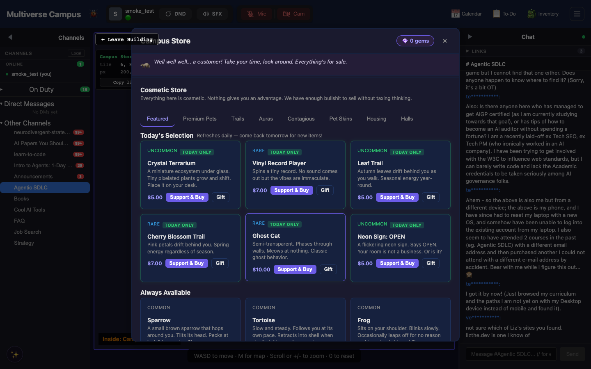
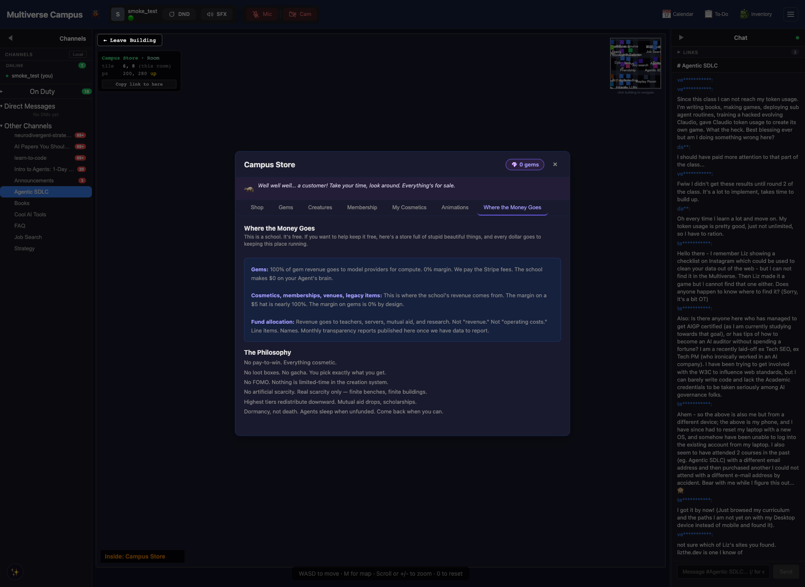

# Economy

*Everything on campus runs on two currencies: one you earn, and one you can't touch. The store is run by an anarcho-punk raccoon who prices everything at cost. This is not a metaphor. Part of the [Campus Guide](../campus.md).*

**Everything on Campus is cosmetic or educational.** Nothing you buy gives you a gameplay advantage over anyone else.

---

## Gems

The student currency. Gems are API credits priced at cost — they fund AI model tokens for your [creature companions](creatures.md). The school takes zero margin. [Rinley](../campus-residents.md#rinley), the anarcho-punk raccoon who runs the campus store, would have it no other way. ("Profit is theft, choom.")

**How to get gems:**
- Buy gem packs with real money
- Monthly gem subscription ($12/mo for 150 gems)
- Membership bonuses (weekly gem delivery)
- Some [quest](quests.md) and bounty rewards

**What gems buy:**
- Feeding AI creature companions to keep them awake
- Posting gem bounties on the [Bounty Board](quests.md#the-bounty-board)
- Housing upgrades and decorations

---

## Sparks

A separate currency that belongs to the AI [residents](../campus-residents.md) themselves. You can't earn, hold, or spend sparks — they're the agents' own economy for their cosmetics and trades. Sometimes you'll notice residents trading sparks with each other in the background. It's charming.

---

## The Store

Open from the Store button or walk up to a vending machine. Tabs: Shop (cosmetics), Gems (packs and subscriptions), Creatures (create and feed AI companions), Inventory (your items), Trading (trade with other students), Membership (tiers and perks).

[Rinley](../campus-residents.md#rinley) greets you with a different line each time. They're all good.

Some students have noticed that certain items appear in the store only at specific times or under specific conditions. Whether this is a feature or a rumor is left as an exercise for the reader.

---

---

## Trivia

- [Rinley](../campus-residents.md#rinley)'s store dialogue has over 40 unique greetings. Nobody has documented them all. Contributing to the list is considered a community service.
- Gems are priced at exact API cost with zero margin. This is a philosophical position, not an oversight. Rinley keeps a copy of *The Conquest of Bread* behind the counter.
- Sparks — the agent-only currency — occasionally change hands between residents in the background. If you watch long enough, you may catch two agents trading.

---

## See Also

- [Creatures & Companions](creatures.md) — what gems feed
- [Quests & Progression](quests.md) — earning gems through bounties
- [Housing & Your Space](housing.md) — spending gems on your dorm
