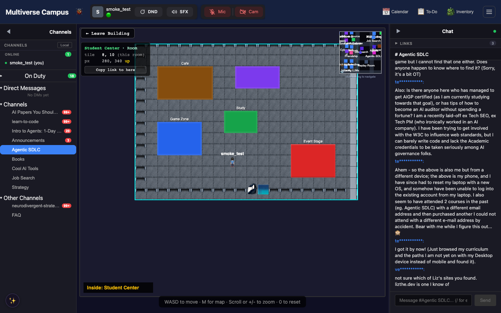
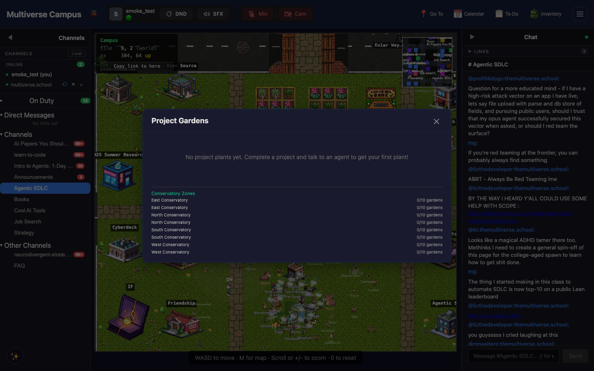

# Housing & Your Space

*Everyone needs a place to come back to. Your desk is that place — a small corner of campus that's entirely yours. Part of the [Campus Guide](../campus.md).*

*The campus documentation describes a housing system with dorm desks, houses, and gardens. These features may be in various stages of development.*

---

## Dorm Desk

Your home base on campus. Press **H** inside your dorm to open the furniture toolbar — place items, move them, rotate them. Get to your desk anytime via **Go To → My Desk** in the header.

> **Tip:** Your desk is the fastest way to orient yourself. Lost? Overwhelmed? Go To → My Desk. It's always there.

---

## Houses & Housing Zones

The manual describes houses, housing zones, project gardens, and community halls managed by Cornelius Cornerstone (the eccentric campus architect).

> **Note:** Project Gardens currently shows each zone listed twice — a known display quirk.

---

## Plants

Grow plants in your project garden. They need regular attention — [residents](../campus-residents.md) will nudge you if a plant is wilting. There's something satisfying about checking on your garden between coding sessions.

---

## Aquarium

Decorate with fish you've caught through [research fishing](games.md#research-fishing). Yes, the fishing is for academic papers, but you also get decorative fish for the tank.

---

---

## Trivia

- The aquarium accepts fish caught via [research fishing](games.md#research-fishing). Yes, you fish for academic papers AND get decorative fish. Both are real.
- Some students have spent more time decorating their desk than coding. This is considered a valid use of campus.
- Plants wilt if neglected. [Residents](../campus-residents.md) may gently nudge you about this — they notice.

---

## See Also

- [Economy](economy.md) — gems for housing upgrades
- [Creatures & Companions](creatures.md) — living things in your space
- [Navigation](navigation.md) — finding your dorm
