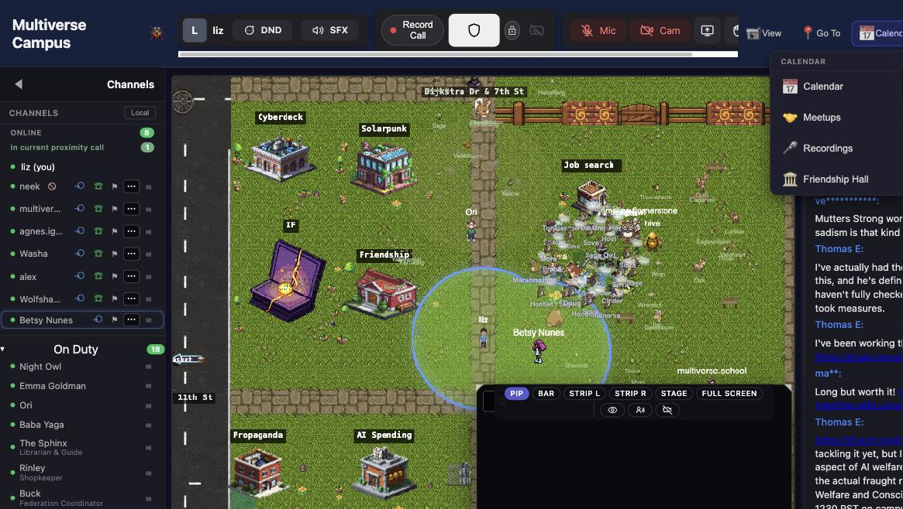

# Proximity Video Chat

*The heart of [Campus](../campus.md). Walk near someone and it starts. Walk away and it stops.*

---

## How It Works

Walk near someone and video/audio starts automatically. Walk away and it stops. No links, no "join meeting" buttons, no scheduling. Just proximity.

It's how casual conversations happen — the hallway bump-in, the "oh hey, what are you working on?", the spontaneous pair-programming session. Many students say this is the single best thing about campus.

---

## Controls

A floating bar appears at the bottom of the screen:

| Button | What it does |
|---|---|
| **Mic** | Mute/unmute |
| **Cam** | Camera on/off |
| **Share** | Screen share |
| **Hand** | Raise/lower your hand |
| **DND** | Toggle quiet mode (no-talk badge above your head) |
| **SFX** | Mute ambient building sounds without affecting call audio |

Before joining, the bar shows mic/cam test buttons with a live mic-level meter.

---

## Captions & Recording

Calls can have **live captions** (real-time transcription) and **recording**. Recordings are saved and accessible later from the Calendar menu. Useful for study sessions you want to revisit.

---

## Tips

- **Turn on your camera.** Proximity chat with faces is a fundamentally different experience than voice-only. Most regulars keep it on.
- **Set your [presence status](avatar.md#presence-status)** if you need heads-down time. Focus mode (🟣) tells everyone you're working.
- **The [social battery](avatar.md#social-battery)** lets you control how calls affect your energy. Introvert mode drains slowly; Extreme Introvert makes you invisible entirely.

---

## See Also

- [Avatar & Identity](avatar.md) — presence status and social battery
- [Classes & Lectures](classes.md) — live class video
- [Chat & Messaging](chat.md) — text-based communication
